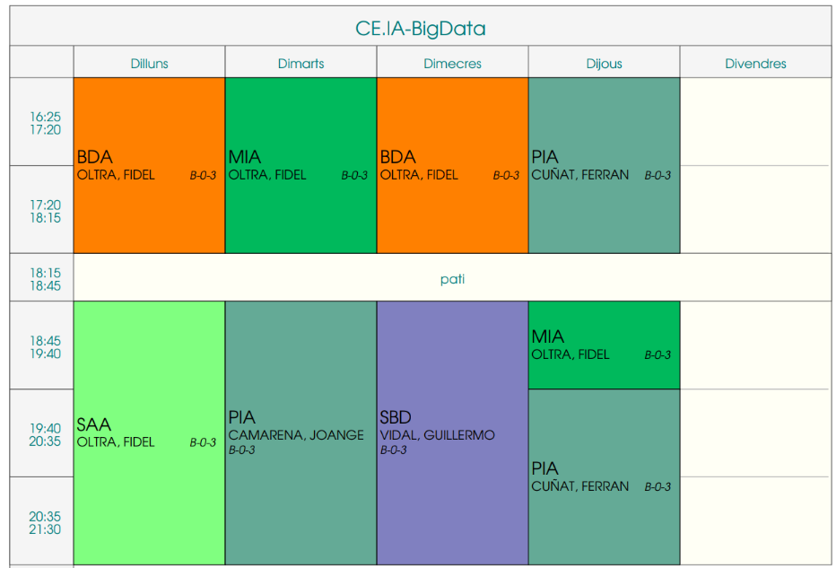

---
# Informació general del document
title: Presentació del curs 2025-2026
subtitle: Curs d'Especialització en IA i Big Data
authors: 
    - Departament d'informàtica
lang: ca
page-background: img/bg.png

# Portada
titlepage: true
titlepage-rule-height: 0
# titlepage-rule-color: AA0000
# titlepage-text-color: AA0000
titlepage-background: img/portada.png
# logo: img/logotext.png

# Taula de continguts
toc: true
toc-own-page: true
toc-title: Continguts

# Capçaleres i peus
header-left: Presentació Curs
header-right: Curs 2025-2026
footer-left: IES Jaume II El Just
footer-right: \thepage/\pageref{LastPage}

# Imatges
float-placement-figure: H
caption-justification: centering

# Llistats de codi
listings-no-page-break: false
listings-disable-line-numbers: false

header-includes:
     - \usepackage{lastpage}
---

# Horari setmanal

# Professorat

* **BDA:** 
    * ***Big Data Aplicat***
    * ***Professor***: Fidel Oltra

* **SAA**
    * ***Sistemes d'Aprenentatge Automàtic***
    * ***Professor***: Fidel Oltra

* **MIA:**
    * ***Models d'Intelligència Artificial***
    * ***Professor***: Fidel Oltra

* **SBD**
  * ***Sistemes de Big Data***
  * ***Professor:*** Guillermo Vidal

* **PIA:**
    * ***Programació d'Intel·ligència Artificial***
    * ***Professors***: Ferran Cunyat i Joan Gerard Camarena 

# Tutoria / Coordinació

* Fidel Oltra
* ***Correu corporatiu***: jf.oltra@edu.gva.es
* ***Tutoríes***: Dimarts 19:40 a 20:35, Divendres 17:30 a 18:15 (amb cita prèvia)
* ***Atenció a Famílies***: Dijous de 17:30 a 18:15 (amb cita prèvia)

